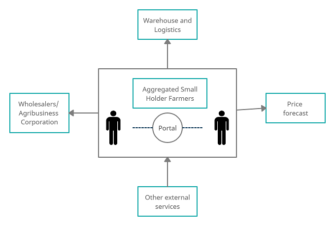
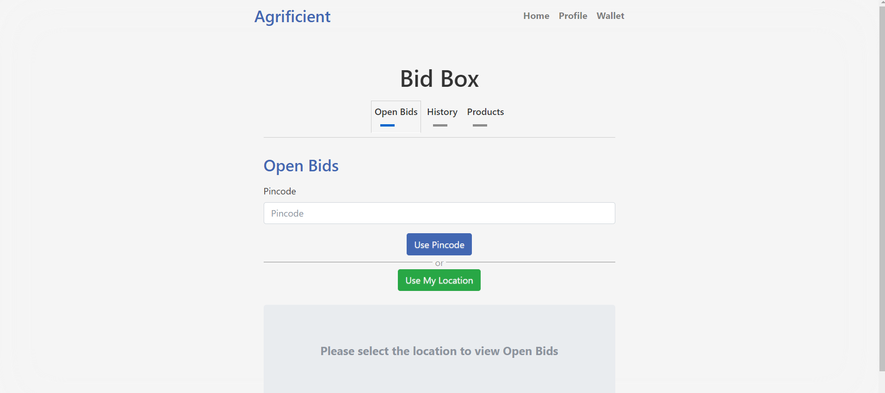
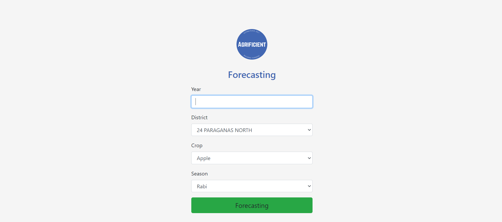

# NodeNerds : Agrificient 


##### A Unified platform that connects farmers (producers) with wholesalers, agribusiness corporations, processors, exporters, and large retailers.

##### Deployed on Heroku: <a href="https://agrificient-nodeapp.herokuapp.com/">Link</a>

## Table of Contents

1. [Introduction](#Introduction)
2. [Purpose](#Introduction)
3. [Features](#Features)
4. [Application Structure](#Application)
5. [Database Schema](#Database)
5. [Prerequisites](#Prerequisites)
6. [Installation](#Installation)
7. [Demonstration](#Demonstration)
8. [Tools-Used](#Tools-Used)
9. [Contributors](#Contributions)

## Introduction

**Agrificient**, will let farmers expand their reach and eventually helps overcome the weakness of current Agricultural Supply Chain. We offer a unified platform that connects farmers (producers) with wholesalers, agribusiness corporations, processors, exporters, and large retailers. It is deliberately developed to help farmers reach out to retailers and Agribusiness corporation to sell their produce. It helps farmers aggregate and even connect with warehouse providers.

## Purpose


**Problems in the current scenario:**

1) Farmers' reach is limited. 
2) Lack of Infrastructure and Storage facilities like Warehouses and Cold storage leading to Post-harvest losses. 
3) Too many middlemen in the supply chain, leading to artificial price rise and huge difference between the price farmer gets and the final consumer pay.

To provide a solution, we have created a website which provides farmer to get sufficient platform and expand their reach. The following diagram shows the overview of system:


## Features

- **Bidding:** Farmers may use online bidding to directly present their goods to the market without the involvement of a middleman, allowing them to receive the highest price for their product without compromising on profit.
Not Found


- **Logistics:** Farmers may considerably reduce expenses by employing an efficient warehouse and transportation facility to get their goods to customers in a timely and safe way. They can also acquire temporary warehousing from a local partner who operates local warehouses.

- **Aggregation:** Aggregation is a multi-party agreement. It is one of the most effective strategies to help agricultural value chains achieve economies of scale. It reduces costs and maximizes throughput. Aggregation enables the delivery of costly and sophisticated services that would otherwise be unavailable on an individual basis.
Not Found


- **Authentication:** To create a trustworthy platform, different mechanisms such as legal and government documentation are used to confirm the legitimacy of buyers and sellers. Increasing confidence and certainty across the supply chain.

- **Forecasting:** Price forecasts based on statistics to keep farmers informed about market prices.

- **Easy to use UI:** Easy to User Interface so that the target audience can use it easily.

## Application Wireframe


- **Express Server:** It serves response to the client.

- **Flask app:** It runs python script to predict future price and production for forecasting. It uses Machine Learning models for prediction. <a href="https://github.com/Node-Nerds/forecast">Link to flask app repository.</a>

- **PostgreSQL Database:** Database used to store data and query as per requirement. It is deployed using heroku-postgres.

## Database Schema


## Prerequisites

1. Node (npm)
2. Python
3. Python Libraries - Pandas, NumPy, scikit-learn, SciPy, seaborn,json, sys, csv, math, os, category_encoders
4. PostgreSQL

## Installation

To get a copy of the website running on your local system follow these steps :

1.  First clone the Repository.

    ```git clone https://github.com/Node-Nerds/Agrificient.git```

2.  Move to the directory and install all the dependencies.

    ```npm install```

3. Deploy PostgreSQL Database on Heroku. Follow the steps given <a href="https://dev.to/prisma/how-to-setup-a-free-postgresql-database-on-heroku-1dc1">here</a>.
    
4. Once done with database deployment create .env file in the root directory and add the following credentials into it.
    ```
    PGUSER=[database user]
    PGHOST=[database host]
    PGPASSWORD=[database password]
    PGDATABASE=[database]
    PGPORT=[database port]
    INITIALBALANCE=15000
    SECRETKEY=This is a secret!!!
    ```

5.  To run the website on localhost.
    ```npm start```

## Demonstration 

- SignIn Page


- SignUp page


- Dashboard


- Bidbox(bidding page)


- Warehouse


- Aggregation


- Wallet


- Forecasting



## Tools-Used

- <a href="https://nodejs.org/">Node</a> - Node.js is an open-source, cross-platform, JavaScript runtime environment that executes JavaScript code outside of a browser.
- <a href="https://jquery.com/">JavaScript (JQuery)</a> - jQuery is a fast, small, and feature-rich JavaScript library.
- <a href="https://www.python.org/">Python</a> - Python is a programming language that lets you work more quickly and integrate your systems more effectively.
- <a href="https://expressjs.com/">Express</a> - Express is a minimal and flexible Node.js web application framework that provides a robust set of features for web and mobile applications.
- <a href="https://seaborn.pydata.org/">Seaborn</a> - Seaborn is a Python data visualization library based on matplotlib. It provides a high-level interface for drawing attractive and informative statistical graphics..
- <a href="https://scikit-learn.org/stable/">Scikit-learn</a> - Scikit-learn is a free software machine learning library for the Python programming language.
- <a href="https://www.scipy.org/">Scipy</a> - SciPy is a free and open-source Python library used for scientific computing and technical computing.
- <a href="https://getbootstrap.com/">Bootstrap</a> - Bootstrap, the world’s most popular front-end open source toolkit.

### Contributors
<table>
    <tr>
        <td align="center"><a href="https://github.com/shrushti22"><br /><sub><b>Shrushti Vasaniya</b></sub></a><br /></td>
        <td align="center"><a href="https://github.com/RutvijDv"><br /><sub><b>Rutvij Vamja</b></sub></a><br /></td>
        <td align="center"><a href="https://github.com/vrutikrabadia"><br /><sub><b>Vrutik Rabadia</b></sub></a><br /></td>
        <td align="center"><a href="https://github.com/YashMaxy"><br /><sub><b>Yash Vadi</b></sub></a><br /></td>
    </tr>
</table>    
